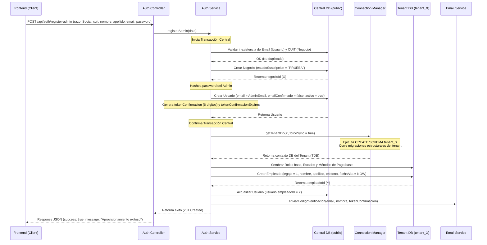

# Diseño de Módulos y Especificación de Autenticación (Auth)

Este documento especifica la distribución arquitectónica de la carpeta `/modules` y detalla el diseño técnico del **Módulo de Autenticación (Auth)** del backend (`back2`), estableciendo las directrices para el desarrollo de sus funcionalidades desde cero.

---

## 1. Distribución y Responsabilidades de Módulos (SaaS)

El directorio `src/modules/` agrupa el backend de forma modular por características de negocio (Feature-First). Cada carpeta representa un módulo autónomo con la siguiente categorización de subcarpetas:

| Subcarpeta | Responsabilidad Técnica |
| :--- | :--- |
| `controllers/` | **Control de Entrada/Salida HTTP:** Procesa los objetos `req` y `res` de Express, valida la autenticación básica, delega la ejecución a los servicios y retorna los códigos HTTP y payloads JSON limpios. |
| `services/` | **Lógica de Negocio Pura:** Funciones JS reutilizables que contienen las reglas operativas, cálculos, interacciones con el ORM (Sequelize) y llamadas a APIs externas. Lanzan `AppError` en caso de fallos de negocio. |
| `validators/` | **Sanitización y Validación:** Reglas de validación de datos de entrada estructuradas con `express-validator` (tipos de datos, longitudes, obligatoriedad, formatos de email/CUIT). |
| `*.routes.js` | **Rutas de Express:** Define los endpoints del módulo, asocia los verbos HTTP y encadena los middlewares de validación, JWT y control de roles. |

### Detalle de Módulos Definidos

1.  **`auth` (Autenticación y Seguridad):** Gestión de credenciales, login local, Google OAuth, confirmación de cuentas, restablecimiento de contraseñas y perfil de usuario (seguridad).
2.  **`pedidos` (Pedidos y Trazabilidad):** Creación y flujo de pedidos, detalles de ítems, cálculo automático de costos e historial cronológico de cambios de estado.
3.  **`clientes` (Clientes y Cuentas):** Registro de clientes y el Libro Mayor de la **Cuenta Corriente** (movimientos de débito y crédito a favor).
4.  **`finanzas` (Finanzas, Caja y AFIP):** Control de flujo de caja (apertura, movimientos, cierres), cobros de pedidos, registro de gastos parametrizados y facturación electrónica autorizada por AFIP.
5.  **`servicios` (Catálogo de Servicios):** Catálogo de prestaciones disponibles (lavado, secado, tintorería) y sus respectivas categorías.
6.  **`rrhh` (Recursos Humanos y Asistencia):** Fichaje de entrada/salida del personal y control de asistencia/horas mensuales.
7.  **`dashboard` (Métricas de Negocio):** Agrupación y cálculo ágil de KPIs del local en tiempo real.
8.  **`reportes` (Generación de Informes):** Reportes analíticos de caja, ventas e IVA.
9.  **`superadmin` (Gestión Global SaaS):** Administración de inquilinos (negocios), suspensión y control de planes de suscripción.
10. **`configuracion` (Ajustes de Tenant):** Configuración visual de colores de marca del negocio, token de MercadoPago y carga de certificados de AFIP.

---

## 2. Módulo de Autenticación (Auth): Especificación Detallada

Este módulo resuelve la seguridad de acceso a la plataforma, el onboarding de nuevos clientes del SaaS y la vinculación de perfiles.

### A. Soporte a los Requerimientos del Frontend
El frontend interactúa con este módulo a través de 4 interfaces críticas definidas en las especificaciones de diseño:
1.  **Pantalla de Login Local/Google:** Requiere un endpoint ágil para validar credenciales y otro para validar idTokens de Google. Espera un payload que retorne un token JWT y datos de perfil básicos (email, nombre, apellido, rol).
2.  **Pantalla de Onboarding (SaaS Registro):** Requiere un alta unificada de negocio y del administrador. Retorna un mensaje indicando que la base de datos y esquema han sido aprovisionados y se ha enviado un mail de confirmación.
3.  **Pantalla de "Validar Email" (Token):** Permite introducir el código de 6 dígitos que el usuario recibió por correo.
4.  **Subvista de Perfil (Dashboard):** Permite cambiar contraseña y vincular/desvincular la cuenta activa de Google.

---

### B. Análisis Comparativo: Modelo Anterior vs. Modelo Nuevo

El nuevo modelo desacopla por completo la **Credencial de Acceso** (seguridad) de los **Datos Personales y Organizativos** (negocio):

| Criterio | Implementación Anterior (`back`) | Nueva Implementación (`back2`) |
| :--- | :--- | :--- |
| **Ubicación del Esquema** | Tabla `usuarios` compartida o en el inquilino de forma acoplada. | `Usuario` y `Rol` residen en el esquema central (`public`). `Empleado` y `Sesion` residen en el esquema del tenant (`tenant_{id}`). |
| **Clave Primaria (PK) de Usuario** | `id` (Entero secuencial) + `negocioId`. | `email` (String) es la clave primaria única a nivel físico. |
| **Separación de Roles** | Campo `rol` como ENUM ("ADMIN", "EMPLEADO") en la tabla de usuarios. | Múltiples roles dinámicos asignados a través de la tabla relacional `UsuarioRoles` que vincula `Usuario` con `Rol`. |
| **Datos Personales** | `nombre`, `apellido`, `telefono` y `sueldoBase` vivían directamente en la tabla `usuarios`. | Atributos movidos a la entidad `Empleado`. El modelo `Usuario` solo tiene credenciales (`email`, `password`, `googleId`). |
| **Vinculación** | Acoplamiento directo. | Un `Usuario` tiene `empleadoId` (nulo para SuperAdmin) que apunta al `Empleado` correspondiente en el esquema del tenant. |

---

### C. Estructura de Archivos del Módulo `auth`

Los archivos que integran el módulo bajo `src/modules/auth/` y sus funciones específicas son:

```
src/modules/auth/
├── controllers/
│    ├── auth.controller.js    # Controla login local, confirmación de email y flujos de contraseña.
│    └── google.controller.js  # Controla la autenticación, verificación de token y login con Google OAuth.
├── services/
│    ├── auth.service.js       # Orquesta el registro del negocio, validación de hashes y tokens.
│    └── email.service.js      # Servicio transaccional de correo (confirmaciones, recuperaciones).
├── validators/
│    └── auth.validator.js     # Reglas para express-validator (validación de formatos de CUIT, contraseña segura, etc.).
└── auth.routes.js             # Mapeo de rutas HTTP a controladores (ver detalle abajo).
```

#### Detalle del Enrutamiento (`auth.routes.js`)
*   `POST /api/auth/register-admin` ➔ Onboarding (Razón Social, CUIT, Admin Email, Password).
*   `POST /api/auth/confirm-email` ➔ Validación del código de 6 dígitos.
*   `POST /api/auth/login` ➔ Autenticación local.
*   `POST /api/auth/google` ➔ Autenticación federada (Google).
*   `POST /api/auth/forgot-password` ➔ Solicitud de código de recuperación.
*   `POST /api/auth/reset-password` ➔ Blanqueo de contraseña con token.
*   `PATCH /api/auth/change-password` ➔ Cambio de contraseña (protegido por token JWT de sesión activa).

---

## 3. Flujos de Ejecución Cronológicos (Flujos de Control)

### 1. Flujo de Registro de Negocio y Onboarding
Secuencia de control al invocar `POST /api/auth/register-admin`:



---

### 2. Flujo de Validación de Email (Token de Confirmación)
Secuencia de control al invocar `POST /api/auth/confirm-email`:

1.  **Recepción:** El controlador recibe `email` y `tokenConfirmacion`.
2.  **Búsqueda:** El servicio busca al `Usuario` por su `email` en la base de datos central.
    *   *Excepción:* Si no existe, retorna `404 Not Found`.
    *   *Excepción:* Si ya estaba confirmado (`emailConfirmado == true`), retorna `400 Bad Request`.
3.  **Validación del Token:**
    *   Verifica que `usuario.tokenConfirmacion === tokenConfirmacion` provisto.
    *   Verifica que la fecha actual sea menor que `usuario.tokenConfirmacionExpires`.
    *   *Excepción:* Si el token es incorrecto o ha expirado, retorna `400 Bad Request`.
4.  **Confirmación:**
    *   Establece `emailConfirmado = true`.
    *   Limpia `tokenConfirmacion` y `tokenConfirmacionExpires` (setea a `null`).
    *   Persiste los cambios en la base de datos central.
5.  **Respuesta:** Retorna éxito `200 OK` permitiendo que el usuario pueda iniciar sesión.

---

### 3. Flujo de Inicio de Sesión Local
Secuencia de control al invocar `POST /api/auth/login`:

1.  **Recepción:** El controlador recibe `email`, `password` y `recaptchaToken`.
2.  **Verificación de reCAPTCHA:** Se valida el token con la API externa de Google. Si falla, retorna `401 Unauthorized` ("Validación humana fallida").
3.  **Búsqueda de Usuario:** El servicio busca en la base de datos central el `Usuario` con el email provisto.
    *   *Seguridad contra enumeración:* Si el usuario no existe o `activo == false`, el servidor arroja genéricamente `401 Unauthorized` ("Credenciales inválidas").
4.  **Validación de Confirmación:**
    *   Comprueba si `emailConfirmado == true`.
    *   *Excepción:* Si es `false`, retorna `403 Forbidden` ("Debe verificar su correo").
5.  **Verificación de Contraseña:**
    *   Compara la contraseña recibida contra `usuario.password` (hash bcrypt).
    *   *Excepción:* Si no coincide, retorna `401 Unauthorized` ("Credenciales inválidas").
6.  **Resolución de Datos del Tenant:**
    *   Se busca el `Empleado` correspondiente a `usuario.empleadoId` en la base de datos de su esquema.
    *   Se determina su `negocioId` y se verifica que el `Negocio` central esté activo.
    *   *Excepción:* Si el negocio está suspendido, retorna `403 Forbidden` ("Suscripción suspendida").
7.  **Registro de Sesión:**
    *   Crea un registro en el modelo `Sesion` en la base de datos del tenant, guardando `fechaHoraInicio = NOW()`, `usuarioEmail = email`.
8.  **Generación de Token JWT:**
    *   Genera un token JWT firmado digitalmente incluyendo en el payload: `{ email, negocioId, empleadoId, roles: [usuario.roles] }`.
9.  **Respuesta:** Retorna `200 OK` con el token JWT y los datos públicos de perfil del usuario.

---

### 4. Flujo de Inicio de Sesión con Google OAuth
Secuencia de control al invocar `POST /api/auth/google`:

1.  **Recepción:** El controlador recibe el `idToken` de Google provisto por el frontend.
2.  **Verificación del Token:** El servicio invoca a `google-auth-library` para descifrar la firma del token con las claves públicas de Google.
    *   *Excepción:* Si el token de Google es inválido o ha expirado, retorna `401 Unauthorized` ("Token de Google inválido").
3.  **Extracción de Datos:** Obtiene el identificador único (`sub` o `googleId`) y el `email` del usuario.
4.  **Búsqueda en Base de Datos Central:** Busca el `Usuario` por `googleId` en el esquema central.
    *   *Flujo Alternativo (Usuario no registrado):* Si no encuentra el `googleId`, busca al usuario por `email`. Si existe, asocia en caliente el `googleId` a su registro (vinculación implícita por correo verificado) y prosigue.
    *   *Excepción:* Si no existe cuenta local asociada, retorna `404 Not Found` indicando que no hay cuenta local asociada a ese correo de Google.
5.  **Verificación de Estado:** Valida que `usuario.activo == true`.
6.  **Inicio de Sesión:**
    *   Registra la `Sesion` en el esquema del tenant correspondiente.
    *   Genera y firma el token JWT del sistema.
7.  **Respuesta:** Retorna `200 OK` con el JWT y el perfil de acceso.
