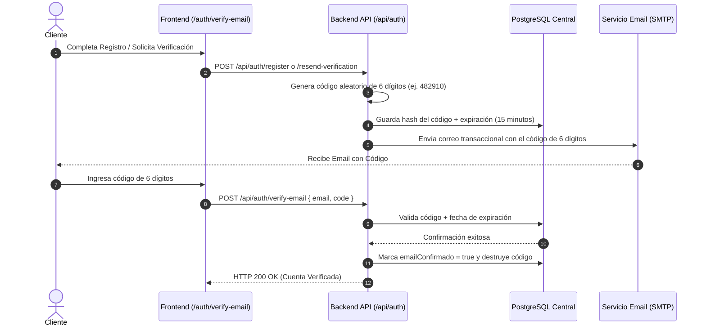

# Especificación de Seguridad: Validación de Emails, Rate Limiting y Protección DoS

Este documento detalla la especificación técnica de **Seguridad, Validación Sanitizada de Emails, Control de Frecuencia (Rate Limiting) y Protección contra Ataques DoS / Fuerza Bruta** para la plataforma SaaS Multi-Tenant de lavandería en el backend `back2`.

---

## 1. Arquitectura de Seguridad y Resiliencia

Para salvaguardar la disponibilidad del sistema y proteger los endpoints de la API frente a denegaciones de servicio (DDoS), intentos masivos de adivinación de credenciales (Fuerza Bruta) y registros spam, la plataforma implementa una estrategia de defensa en profundidad basada en:

1.  **Sanitización y Validación Sanitizada de Entradas (`express-validator`)**.
2.  **Protección de Cabeceras HTTP de Infraestructura (`helmet`)**.
3.  **Manejo de CORS Dinámico por Tenant (`dynamicCors`)**.
4.  **Control Escalonado de Frecuencia de Peticiones (`express-rate-limit`)**.
5.  **Verificación Transaccional de Correo Electrónico en 2 Pasos (Código de 6 dígitos)**.

---

## 2. Validación Sanitizada y Normalización de Emails

El módulo de autenticación exige que toda dirección de correo electrónico recibida pase por tres filtros de sanitización antes de llegar a los controladores de negocio:

### Reglas de Sanitización de Email (`auth.validator.js`)
*   **Format Check (`isEmail()`):** Garantiza que la cadena cumpla la estructura estándar RFC 5322 (`usuario@dominio.com`). Rechaza caracteres no válidos.
*   **Normalización (`toLowerCase()`):** Convierte la dirección a minúsculas absolutas antes de consultar la base de datos para prevenir duplicación por variaciones tipográficas (ej. `Juan@Gmail.com` y `juan@gmail.com` se identifican como la misma cuenta).
*   **Sanitización de Espacios (`trim()`):** Remueve espacios en blanco accidentales al inicio o final.

---

### Flujo de Verificación Transaccional de Correo (Código de 6 Dígitos)



#### Endpoints de Verificación de Email:
1.  **Verificar Código (`POST /api/auth/verify-email`)**
    *   Payload: `{ "email": "usuario@dominio.com", "code": "482910" }`
    *   Validación: Compara el código ingresado contra el hash en DB y verifica que `now() < emailVerificationExpires`.
2.  **Reenviar Código (`POST /api/auth/resend-verification`)**
    *   Payload: `{ "email": "usuario@dominio.com" }`
    *   Regla de Frecuencia: Genera un nuevo código de 6 dígitos con expiración renovada de 15 minutos y dispara el envío SMTP.

---

## 3. Control Escalonado de Rate Limiting (Protección DoS y Fuerza Bruta)

El sistema utiliza **`express-rate-limit`** para aplicar una arquitectura de limitación de tasa por dirección IP en dos niveles de severidad:

### A. Limitador Estricto de Autenticación (`authLimiter`)
Protege los puntos de entrada sensibles contra ataques de Fuerza Bruta (brute-force dictionary attacks) y enumeración de usuarios.

*   **Rutas Protegidas:** `/api/auth/login`, `/api/auth/register`, `/api/auth/verify-email`, `/api/auth/forgot-password`, `/api/auth/reset-password`.
*   **Ventana de Tiempo (`windowMs`):** 15 minutos ($900\,000\text{ ms}$).
*   **Límite Máximo (`max`):** **20 peticiones por IP**.
*   **Comportamiento al Exceder:** Retorna HTTP `429 Too Many Requests` con el cuerpo:
    ```json
    {
      "error": "Demasiadas peticiones desde esta IP, intente de nuevo en 15 minutos."
    }
    ```

---

### B. Limitador Global de API (`globalLimiter`)
Protege a todo el backend frente a inundación de tráfico (traffic flooding) o scraping no autorizado.

*   **Rutas Protegidas:** Todas las rutas del sistema bajo `/api/*`.
*   **Ventana de Tiempo (`windowMs`):** 15 minutos ($900\,000\text{ ms}$).
*   **Límite Máximo (`max`):** **1000 peticiones por IP**.
*   **Comportamiento al Exceder:** Retorna HTTP `429 Too Many Requests` con el cuerpo:
    ```json
    {
      "error": "Has excedido el límite de peticiones. Intenta nuevamente más tarde."
    }
    ```

---

### C. Cabeceras HTTP de Diagnóstico de Tasa (RFC Standard)

En cada respuesta HTTP, el servidor inyecta las cabeceras estándar para que los clientes del frontend o consumidores de API conozcan su cuota de consumo:

```http
HTTP/1.1 200 OK
RateLimit-Limit: 1000
RateLimit-Remaining: 994
RateLimit-Reset: 1770932400
```

---

## 4. Implementación en Código (`app.js`)

```javascript
import rateLimit from "express-rate-limit";
import helmet from "helmet";

// 1. Cabeceras de Seguridad
app.use(helmet());

// 2. Rate Limiting Global: Protege a TODA la API de ataques DDoS o saturación
const globalLimiter = rateLimit({
    windowMs: 15 * 60 * 1000, // 15 minutos
    max: 1000, // Máximo 1000 peticiones por IP
    message: { error: "Has excedido el límite de peticiones. Intenta nuevamente más tarde." },
    standardHeaders: true,
    legacyHeaders: false,
    skip: (req) => process.env.NODE_ENV === "test" || process.env.NODE_ENV === "development"
});

// 3. Rate Limiting Estricto para Auth (Prevención de Fuerza Bruta)
const authLimiter = rateLimit({
    windowMs: 15 * 60 * 1000, // 15 minutos
    max: 20, // Máximo 20 intentos de auth en 15 minutos
    message: { error: "Demasiadas peticiones desde esta IP, intente de nuevo en 15 minutos." },
    skip: (req) => process.env.NODE_ENV === "test" || process.env.NODE_ENV === "development"
});

// Aplicación de Middlewares
app.use("/api/", globalLimiter);
app.use("/api/auth", authLimiter, authRoutes);
```

---

## 5. Diagnóstico de Códigos de Respuesta de Seguridad HTTP

| Código HTTP | Diagnóstico de Seguridad | Causa y Acción del Sistema |
| :---: | :--- | :--- |
| **400 Bad Request** | Formato de email o código inválido | Dirección de correo con sintaxis incorrecta o código de verificación distinto a 6 dígitos. |
| **429 Too Many Requests** | Exceso de límite de tasa (Rate Limit Exceeded) | La IP superó las 20 peticiones de auth o 1000 globales en los últimos 15 min. |
