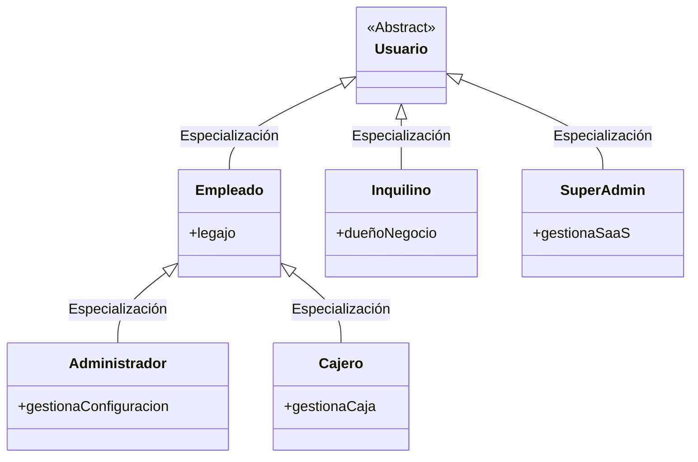

# Casos de Uso y Jerarquía de Actores (UML 2.0)

Este documento detalla la jerarquía de actores del sistema y el catálogo completo de Casos de Uso (CU) definidos para el desarrollo de la plataforma SaaS de lavandería.

---

## 1. Jerarquía de Actores

El sistema define actores físicos (operadores humanos), de soporte (clientes externos) y sistemas externos (servicios de terceros) con relaciones de generalización y especialización de acuerdo con los estándares UML 2.0.

### Detalle de los Actores

#### Actores Primarios (Operadores del Sistema)
*   **Usuario (Actor Abstracto):** Representa la base común de credenciales de seguridad (`email`/`password`) y las propiedades de sesión en el sistema.
*   **Inquilino / Dueño de Lavandería:** Persona física externa que adquiere el servicio SaaS. Registra su negocio y su perfil.
*   **Empleado (Actor Físico):** Personal contratado por una lavandería. Registra su asistencia, opera en el día a día y interactúa con clientes.
    *   **Cajero:** Empleado especializado responsable de los cobros en el mostrador, registrar egresos menores de dinero y realizar arqueos de caja.
    *   **Administrador:** Empleado especializado (normalmente el dueño del local o gerente) que tiene facultades plenas dentro de su base de datos aislada para parametrizar el negocio (branding, AFIP, Mercado Pago, catálogo de servicios, tarifas y reporte de asistencia del personal).
*   **SuperAdmin:** Operador global de la empresa proveedora de software SaaS. No pertenece a ninguna lavandería en particular. Su ámbito es de control general (monitorear uso, registrar y suspender inquilinos).

#### Actores Secundarios (Sistemas Externos)
*   **AFIP / ARCA (Administración de Ingresos Públicos):** Servicio fiscal gubernamental que homologa y autoriza facturas electrónicas de venta (retorna número de CAE).
*   **Mercado Pago:** Pasarela de pago externa para cobros mediante tarjeta de crédito/débito o códigos QR.
*   **Servidor de Correo (SMTP):** Proveedor externo para el envío de notificaciones críticas (códigos de verificación de cuentas y links de recuperación de claves).

---

## 2. Catálogo de Casos de Uso (CU)

*Nomenclatura formal de la UTN FRC: Verbo en Infinitivo + Objeto.*

### MÓDULO 1: SaaS y Configuración
*   **`CU-01: Registrar Cuenta de Negocio`**
    *   *Actor Primario:* Inquilino / Dueño de Lavandería.
    *   *Actor Secundario:* Servidor de Correo.
*   **`CU-02: Configurar Identidad Visual y Datos Fiscales`**
    *   *Actor Primario:* Administrador de Lavandería.
*   **`CU-03: Configurar Conexión AFIP`**
    *   *Actor Primario:* Administrador de Lavandería.
    *   *Actor Secundario:* AFIP / ARCA.
*   **`CU-04: Configurar Integración de Mercado Pago`**
    *   *Actor Primario:* Administrador de Lavandería.
    *   *Actor Secundario:* Mercado Pago.

### MÓDULO 2: Seguridad y RRHH
*   **`CU-05: Iniciar Sesión`**
    *   *Actor Primario:* Usuario.
    *   *Actor Secundario:* Google reCAPTCHA.
*   **`CU-06: Cerrar Sesión`**
    *   *Actor Primario:* Usuario.
*   **`CU-07: Caducar Sesión`**
    *   *Actor Primario:* Sistema (Tiempo).
*   **`CU-08: Confirmar Cuenta de Usuario`**
    *   *Actor Primario:* Inquilino.
    *   *Actor Secundario:* Servidor de Correo.
*   **`CU-09: Vincular Cuenta de Google`**
    *   *Actor Primario:* Usuario.
*   **`CU-10: Registrar Empleado`**
    *   *Actor Primario:* Administrador de Lavandería.
*   **`CU-11: Modificar Empleado`**
    *   *Actor Primario:* Administrador de Lavandería.
*   **`CU-12: Consultar Empleado`**
    *   *Actor Primario:* Administrador de Lavandería.
*   **`CU-13: Eliminar Empleado (Baja Lógica)`**
    *   *Actor Primario:* Administrador de Lavandería.
*   **`CU-14: Registrar Fichaje de Asistencia`**
    *   *Actor Primario:* Empleado.

### MÓDULO 3: Catálogo de Servicios
*   **`CU-15: Gestionar Categorías de Servicio`**
    *   *Actor Primario:* Administrador de Lavandería.
*   **`CU-16: Gestionar Servicios`**
    *   *Actor Primario:* Administrador de Lavandería.

### MÓDULO 4: Pedidos y Trazabilidad
*   **`CU-17: Registrar Pedido`**
    *   *Actor Primario:* Empleado.
*   **`CU-18: Cambiar Estado de Pedido (Trazabilidad)`**
    *   *Actor Primario:* Empleado.
*   **`CU-19: Consultar Tracking de Ropa`**
    *   *Actor Primario:* Cliente (Externo).
*   **`CU-20: Imprimir Ticket`**
    *   *Actor Primario:* Empleado.

### MÓDULO 5: Cuenta Corriente
*   **`CU-21: Ajustar Crédito de Cliente`**
    *   *Actor Primario:* Administrador de Lavandería.
*   **`CU-22: Liquidar Deuda de Cliente (Cobro Masivo)`**
    *   *Actor Primario:* Cajero.

### MÓDULO 6: Finanzas y AFIP
*   **`CU-23: Abrir/Cerrar Caja (Arqueo)`**
    *   *Actor Primario:* Cajero.
*   **`CU-24: Registrar Gasto`**
    *   *Actor Primario:* Cajero.
*   **`CU-25: Cobrar Pedido`**
    *   *Actor Primario:* Cajero.
    *   *Actor Secundario:* Mercado Pago (Opcional).
*   **`CU-26: Facturar Venta (AFIP)`**
    *   *Actor Primario:* Cajero.
    *   *Actor Secundario:* AFIP / ARCA.
