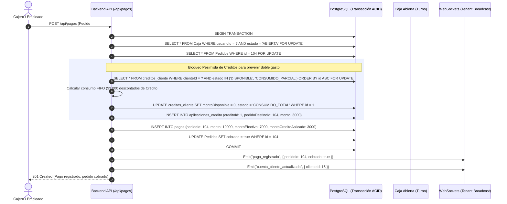
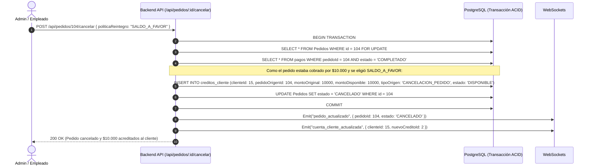

# Especificación Técnica & Funcional de Backend: Sistema de Cuenta Corriente y Gestión de Saldos

> **Documento de Arquitectura y Reglas de Negocio del Backend**  
> **Versión:** 1.0.0  
> **Sistema:** Lavandería SaaS Multi-Tenant  
> **Paradigma:** Libro Mayor Contable (Ledger Inmutable por Pedidos)

---

## 1. Visión General y Paradigma de Arquitectura

El sistema de cuenta corriente abandona el modelo de saldo estático mutable (`Cliente.saldoCuentaCorriente`) y adopta un **Libro Mayor Inmutable (Ledger)** basado estrictamente en el ciclo de vida y los pagos de los **Pedidos**.

```
                   ┌───────────────────────────────────────────────┐
                   │             MODELO DE LIBRO MAYOR             │
                   └───────────────────────────────────────────────┘

        PEDIDOS ENTREGADOS SIN COBRAR            CRÉDITOS A FAVOR DISPONIBLES
       ┌─────────────────────────────┐         ┌─────────────────────────────┐
       │ Pedido #101: $15.000 (Pend) │         │ Crédito #1 (Ped #90): $3.000│
       │ Pedido #104: $10.000 (Pend) │         │ Crédito #2 (Ped #95): $2.000│
       └──────────────┬──────────────┘         └──────────────┬──────────────┘
                      │                                       │
                      ▼                                       ▼
            Total Deuda: $25.000                   Total a Favor: $5.000
                      │                                       │
                      └───────────────────┬───────────────────┘
                                          │
                                          ▼
                             ┌────────────────────────┐
                             │ SALDO NETO: -$20.000   │
                             │ (Cliente debe $20.000) │
                             └────────────────────────┘
```

### Principios Fundamentales
1. **Cálculo Determinístico en Vivo:** La deuda exigible de un cliente se calcula en tiempo real sumando los pedidos en estado `ENTREGADO` con `cobrado = false`.
2. **Trazabilidad 1 a 1 de Créditos:** Todo crédito a favor nace obligatoriamente con un `pedidoOrigenId`, un `montoOriginal`, un `montoDisponible` y un estado de ciclo de vida.
3. **Consumo Atómico y Bloqueo Pesimista:** Al consumir créditos a favor, se ejecuta un bloqueo pesimista `SELECT ... FOR UPDATE` dentro de una transacción ACID (`sequelize.transaction`) para prevenir condiciones de carrera y doble gasto.
4. **Separación de Caja Física y Crédito:** En cobros mixtos (Efectivo + Saldo a favor), solo el efectivo real impacta en la tabla `Caja`, mientras que el crédito se asienta en `AplicacionCredito`.

---

## 2. Reglas de Negocio Estrictas

### Regla 1: Génesis de Deuda y Estado Exigible
* **No Exigibilidad Prematura:** Un pedido en estado `PENDIENTE`, `EN_PROCESO` o `LISTO_PARA_RETIRAR` representa un trabajo operativo en curso. **NO constituye una deuda exigible** ni se imputa como saldo en contra en la cuenta del cliente.
* **Exigibilidad Legal:** Únicamente cuando el pedido pasa a estado **`ENTREGADO`** y su campo `cobrado === false`, el monto total del pedido se computa como **Deuda Exigible**.

### Regla 2: Génesis de Saldos a Favor (Créditos)
Todo saldo a favor debe originarse a partir de un evento auditable:
1. **Sobrepago en Efectivo (`SOBREPAGO_EFECTIVO`):** El cliente paga con un billete superior al total de un pedido y decide no retirar el vuelto, dejándolo a cuenta para futuros pedidos.
2. **Cancelación de Pedido Cobrado (`CANCELACION_PEDIDO`):** Al cancelar un pedido que ya había sido cobrado previamente, el cliente opta por no retirar el dinero de caja y dejarlo acreditado a su favor.
3. **Ajuste Manual / Compensación (`AJUSTE_MANUAL`):** Exclusivo de administradores con motivo obligatorio (e.g., bonificación o compensación de servicio).

### Regla 3: Ciclo de Vida de un Crédito
Cada registro de crédito (`CreditoCliente`) posee un ciclo de vida estricto:
* `DISPONIBLE`: `montoDisponible === montoOriginal`.
* `CONSUMIDO_PARCIAL`: `0 < montoDisponible < montoOriginal`.
* `CONSUMIDO_TOTAL`: `montoDisponible === 0`.
* `ANULADO`: En caso de anulación administrativa o reversión de pago.

### Regla 4: Prioridad de Consumo (Estrategia FIFO)
Cuando un cliente posee múltiples créditos a favor y decide utilizarlos para pagar un pedido, el sistema los imputa en orden cronológico ascendente (**FIFO - First In, First Out**), consumiendo primero los créditos más antiguos.

### Regla 5: Políticas de Cancelación
| Estado Inicial del Pedido | ¿Cobrado? | Acción al Cancelar | Impacto Contable en Caja | Impacto en Cuenta Corriente |
| :--- | :--- | :--- | :--- | :--- |
| `PENDIENTE` / `EN_PROCESO` | `false` | Cancelar sin más | Ninguno ($0) | Ninguno ($0) |
| `ENTREGADO` | `false` | Cancelar pedido | Ninguno ($0) | Se elimina la deuda exigible |
| Cualquier Estado | `true` | Opción A: **Devolver en Caja** | Egreso de efectivo en `Caja` activa | Ninguno ($0) |
| Cualquier Estado | `true` | Opción B: **Dejar a Favor** | No mueve caja física | Genera nuevo `CreditoCliente` |

---

## 3. Modelo de Datos (Esquema PostgreSQL / Sequelize)

### 3.1. Nueva Tabla: `creditos_cliente`
Almacena los créditos a favor generados a favor del cliente.

```javascript
// back/src/models/CreditoCliente.js
export default (sequelize, DataTypes) => {
    const CreditoCliente = sequelize.define("CreditoCliente", {
        id: {
            type: DataTypes.INTEGER,
            primaryKey: true,
            autoIncrement: true
        },
        negocioId: {
            type: DataTypes.INTEGER,
            allowNull: false
        },
        clienteId: {
            type: DataTypes.INTEGER,
            allowNull: false
        },
        pedidoOrigenId: {
            type: DataTypes.INTEGER,
            allowNull: true // Nullable solo si es AJUSTE_MANUAL sin pedido
        },
        montoOriginal: {
            type: DataTypes.DECIMAL(10, 2),
            allowNull: false
        },
        montoDisponible: {
            type: DataTypes.DECIMAL(10, 2),
            allowNull: false
        },
        tipoOrigen: {
            type: DataTypes.ENUM("SOBREPAGO_EFECTIVO", "CANCELACION_PEDIDO", "AJUSTE_MANUAL"),
            allowNull: false
        },
        estado: {
            type: DataTypes.ENUM("DISPONIBLE", "CONSUMIDO_PARCIAL", "CONSUMIDO_TOTAL", "ANULADO"),
            defaultValue: "DISPONIBLE",
            allowNull: false
        },
        motivo: {
            type: DataTypes.TEXT,
            allowNull: true
        },
        creadoPorId: {
            type: DataTypes.INTEGER,
            allowNull: true
        }
    }, {
        tableName: "creditos_cliente",
        indexes: [
            { fields: ["negocioId", "clienteId", "estado"] },
            { fields: ["pedidoOrigenId"] }
        ]
    });

    return CreditoCliente;
};
```

### 3.2. Nueva Tabla: `aplicaciones_credito`
Tabla de auditoría que documenta exactamente cuánto crédito se utilizó, en qué cobro y para qué pedido.

```javascript
// back/src/models/AplicacionCredito.js
export default (sequelize, DataTypes) => {
    const AplicacionCredito = sequelize.define("AplicacionCredito", {
        id: {
            type: DataTypes.INTEGER,
            primaryKey: true,
            autoIncrement: true
        },
        negocioId: {
            type: DataTypes.INTEGER,
            allowNull: false
        },
        creditoId: {
            type: DataTypes.INTEGER,
            allowNull: false
        },
        pagoDestinoId: {
            type: DataTypes.INTEGER,
            allowNull: false
        },
        pedidoDestinoId: {
            type: DataTypes.INTEGER,
            allowNull: false
        },
        montoAplicado: {
            type: DataTypes.DECIMAL(10, 2),
            allowNull: false
        }
    }, {
        tableName: "aplicaciones_credito",
        timestamps: true,
        updatedAt: false, // Solo createdAt
        indexes: [
            { fields: ["negocioId", "creditoId"] },
            { fields: ["pagoDestinoId"] },
            { fields: ["pedidoDestinoId"] }
        ]
    });

    return AplicacionCredito;
};
```

### 3.3. Modificaciones a Tablas Existentes

#### Tabla `pagos` (`Pago`)
Se agregan columnas para trazabilidad de pagos mixtos:
* `montoEfectivoTarjeta`: `DECIMAL(10, 2)` (Monto real cobrado por caja/medio de pago externo).
* `montoCreditoAplicado`: `DECIMAL(10, 2)` (Porción del total cubierta con saldo a favor).

#### Asociaciones Sequelize (`models/index.js`)
```javascript
// Cliente
models.Cliente.hasMany(models.CreditoCliente, { foreignKey: "clienteId", as: "creditos" });
models.CreditoCliente.belongsTo(models.Cliente, { foreignKey: "clienteId", as: "cliente" });

// Pedido Origen -> Credito
models.Pedido.hasMany(models.CreditoCliente, { foreignKey: "pedidoOrigenId", as: "creditosGenerados" });
models.CreditoCliente.belongsTo(models.Pedido, { foreignKey: "pedidoOrigenId", as: "pedidoOrigen" });

// Credito -> Aplicaciones
models.CreditoCliente.hasMany(models.AplicacionCredito, { foreignKey: "creditoId", as: "aplicaciones" });
models.AplicacionCredito.belongsTo(models.CreditoCliente, { foreignKey: "creditoId", as: "credito" });

// Pago -> Aplicaciones
models.Pago.hasMany(models.AplicacionCredito, { foreignKey: "pagoDestinoId", as: "aplicacionesCredito" });
models.AplicacionCredito.belongsTo(models.Pago, { foreignKey: "pagoDestinoId", as: "pago" });
```

---

## 4. Endpoints de la API REST

### 4.1. `GET /api/clientes/:id/estado-cuenta`
Obtiene la posición financiera consolidada del cliente calculada en vivo.

* **Seguridad:** Requiere JWT y rol `admin` o `empleado`.
* **Respuesta Exitosa (200 OK):**
```json
{
  "success": true,
  "data": {
    "cliente": {
      "id": 15,
      "nombre": "Juan Pérez",
      "telefono": "+5491144445555"
    },
    "resumen": {
      "deudaExigible": 15000.00,
      "deudaNoExigible": 8500.00,
      "saldoAFavorDisponible": 3000.00,
      "saldoNeto": -12000.00,
      "pedidosDeudoresCount": 2,
      "creditosDisponiblesCount": 1
    },
    "pedidosDeudores": [
      {
        "id": 104,
        "codigoSeguimiento": "PED-00104",
        "total": 10000.00,
        "estado": "ENTREGADO",
        "fechaEntrega": "2026-08-01T14:30:00.000Z",
        "itemsResumen": "2x Edredón King"
      },
      {
        "id": 108,
        "codigoSeguimiento": "PED-00108",
        "total": 5000.00,
        "estado": "ENTREGADO",
        "fechaEntrega": "2026-08-02T18:00:00.000Z",
        "itemsResumen": "1x Valija Ropa"
      }
    ],
    "pedidosEnCurso": [
      {
        "id": 115,
        "codigoSeguimiento": "PED-00115",
        "total": 8500.00,
        "estado": "EN_PROCESO",
        "createdAt": "2026-08-03T10:00:00.000Z"
      }
    ],
    "creditosDisponibles": [
      {
        "id": 1,
        "pedidoOrigenId": 98,
        "codigoPedidoOrigen": "PED-00098",
        "tipoOrigen": "SOBREPAGO_EFECTIVO",
        "montoOriginal": 5000.00,
        "montoDisponible": 3000.00,
        "createdAt": "2026-07-28T16:20:00.000Z"
      }
    ]
  }
}
```

---

### 4.2. `GET /api/clientes/:id/movimientos-cuenta`
Retorna el libro mayor cronológico del cliente unificando cargos (pedidos entregados), cobros y créditos aplicados.

* **Parámetros de Query:**
  * `page` (default: 1)
  * `limit` (default: 20)
  * `desde` (ISO Date opcional)
  * `hasta` (ISO Date opcional)
* **Respuesta Exitosa (200 OK):**
```json
{
  "success": true,
  "data": {
    "items": [
      {
        "id": "mov_12",
        "fecha": "2026-08-03T18:30:00.000Z",
        "tipo": "PAGO_RECIBIDO",
        "monto": 7000.00,
        "medioPago": "Efectivo + Saldo a favor",
        "pedidoId": 104,
        "codigoSeguimiento": "PED-00104",
        "detalle": "Cobro de pedido con $4.000 Efectivo y $3.000 Saldo a favor"
      },
      {
        "id": "mov_11",
        "fecha": "2026-08-01T14:30:00.000Z",
        "tipo": "DEUDA_GENERADA",
        "monto": 10000.00,
        "pedidoId": 104,
        "codigoSeguimiento": "PED-00104",
        "detalle": "Pedido entregado sin abonar"
      }
    ],
    "meta": { "totalItems": 12, "totalPages": 1, "currentPage": 1 }
  }
}
```

---

### 4.3. `POST /api/pagos` (Cobro con Saldo a Favor / Multi-Funding)
Permite cobrar un pedido combinando dinero de caja y saldos a favor existentes.

* **Request Body:**
```json
{
  "pedidoId": 104,
  "metodoPagoId": 1,
  "montoEfectivo": 7000.00,
  "aplicarSaldoAFavor": true,
  "montoSaldoAFavor": 3000.00,
  "dejarVueltoAFavor": false,
  "facturarAfip": false
}
```
* **Lógica Transaccional (ACID):**
  1. Abre transacción `t = await sequelize.transaction()`.
  2. Valida caja abierta para el usuario actual.
  3. Bloquea pedido con `findByPk(pedidoId, { transaction: t, lock: true })`.
  4. Si `aplicarSaldoAFavor === true`:
     - Consulta créditos disponibles del cliente con `lock: t.LOCK.UPDATE`.
     - Verifica que la suma de `montoDisponible >= montoSaldoAFavor`.
     - Consume créditos en orden FIFO y actualiza sus estados.
     - Crea registros en `AplicacionCredito`.
  5. Si `montoEfectivo > 0`, registra movimiento de ingreso en `Caja`.
  6. Si hubo sobrepago en efectivo y `dejarVueltoAFavor === true`, crea un nuevo `CreditoCliente`.
  7. Marca pedido como `cobrado = true`.
  8. `await t.commit()`.

---

### 4.4. `POST /api/clientes/:id/cobrar-deuda`
Permite saldar uno o múltiples pedidos entregados en una única operación contable.

* **Request Body:**
```json
{
  "pedidosIds": [104, 108],
  "metodoPagoId": 2,
  "montoAbonado": 15000.00,
  "aplicarSaldoAFavor": false,
  "comentario": "Pago de deuda acumulada por transferencia"
}
```
* **Respuesta Exitosa (200 OK):**
```json
{
  "success": true,
  "message": "Deuda saldada exitosamente (2 pedidos cobrados)",
  "data": {
    "totalCobrado": 15000.00,
    "pedidosActualizados": [104, 108],
    "pagosGenerados": [45, 46]
  }
}
```

---

### 4.5. `POST /api/pedidos/:id/cancelar` (Política de Reintegro)
Cancela un pedido y gestiona la devolución según la política elegida.

* **Request Body:**
```json
{
  "motivo": "Cliente no puede esperar el servicio",
  "politicaReintegro": "SALDO_A_FAVOR" // Opciones: "SALDO_A_FAVOR" | "DEVOLUCION_CAJA" | "SIN_REINTEGRO"
}
```

---

## 5. Diagramas de Flujos de Datos

### 5.1. Flujo: Cobro Mixto con Consumo de Saldo a Favor y Bloqueo Concurrente



---

### 5.2. Flujo: Cancelación de Pedido con Acreditación a Cuenta Corriente



---

## 6. Mecanismos de Seguridad y Resiliencia

1. **Prevención de Doble Gasto (Race Conditions):**
   - El uso de `lock: t.LOCK.UPDATE` garantiza que si dos cajeros intentan aplicar el mismo saldo a favor en pedidos distintos al mismo milisegundo, la segunda transacción esperará o fallará limpiamente con error `409 Conflict: Saldo insuficiente o ya consumido`.
2. **Arqueo de Caja Libre de Errores:**
   - La tabla `Caja` solo suma `montoEfectivo`. Nunca se mezcla saldo contable virtual con dinero billete real.
3. **Auditoría Permanente:**
   - Nunca se borran registros de la tabla `aplicaciones_credito` ni de `creditos_cliente`. En caso de error o anulación, se insertan registros compensatorios de contra-asiento.

---

## 7. Plan de Implementación por Fases

```
[FASE 1] Modelos y Migraciones
   ├── Crear modelo CreditoCliente (creditos_cliente)
   ├── Crear modelo AplicacionCredito (aplicaciones_credito)
   └── Configurar asociaciones y llaves foráneas en models/index.js

[FASE 2] Servicios de Negocio (Backend Core)
   ├── cliente-cuenta.service.js (Cálculo dinámico de estado de cuenta y movimientos)
   ├── credito.service.js (Consumo atómico FIFO con bloqueo pesimista)
   └── Extensión de pago-core.service.js (Multi-funding: Caja + Crédito)

[FASE 3] Rutas y Controladores
   ├── GET /api/clientes/:id/estado-cuenta
   ├── GET /api/clientes/:id/movimientos-cuenta
   ├── POST /api/clientes/:id/cobrar-deuda
   └── Actualización de POST /api/pagos y cancelación de pedidos

[FASE 4] Tests Automatizados
   ├── Prueba unitaria de cálculo en vivo de deuda exigible
   ├── Prueba de estrés de concurrencia (doble gasto)
   └── Prueba de consistencia de arqueo de caja
```
