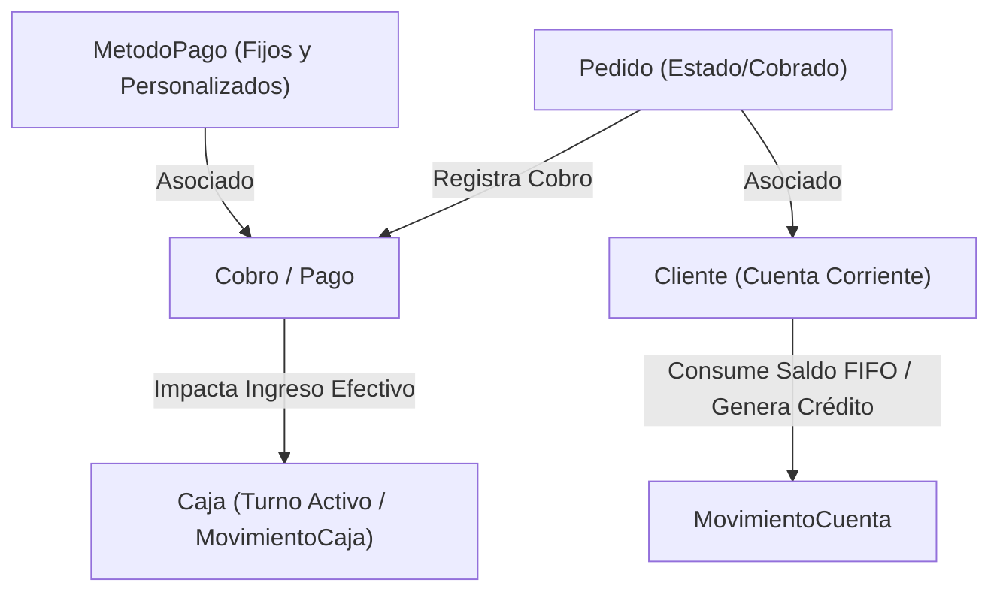

# Especificación Técnica de API y Requerimientos: Lógicas Cruzadas de Cobros, Métodos de Pago, Saldos a Favor y Cajas

**Estándar de Documentación de Cátedra (UTN FRC)**  
**Proyecto:** SaaS Lavandería Multi-Negocio  
**Módulo:** Intersección Contable - Métodos de Pago, Cobros, Saldos a Favor y Cajas  

---

## 1. Arquitectura y Modelo de Consistencia ACID

### El Desafío de la Intersección Contable y Métodos de Pago

La conciliación financiera de una lavandería conecta 5 entidades del sistema en una sola transacción atómica:



---

## 2. Mapeo de Casos de Uso, Actores y Componentes UI del Frontend

| Caso de Uso (CU) | Actores Autorizados | Pantalla / Componente Frontend (UI) | Funcionalidad y Endpoint Backend |
| :--- | :---: | :--- | :--- |
| **CU-30: Gestionar Métodos de Pago** | Admin | `/admin/configuraciones`<br>`PaymentsForm.tsx` | `GET /api/pagos/metodos`<br>`POST /api/pagos/metodos`<br>`PATCH /api/pagos/metodos/:id`<br>`DELETE /api/pagos/metodos/:id`<br>Alta, baja y modificación de formas de cobro. |
| **CU-31: Cobrar Pedido Mostrador** | Admin, Empleado | `/admin/pedidos` o `/pos/pedidos`<br>`cobrar-pedido-sheet.tsx` (`ResponsiveSheet`) | `POST /api/pagos`<br>Registro de cobro con método asignado, consumo FIFO de saldo a favor e ingreso a Caja. |
| **CU-32: Retener Vuelto como Crédito** | Admin, Empleado | `cobrar-pedido-sheet.tsx`<br>Checkbox *"Dejar vuelto como saldo a favor"* | `registrarPago()` en `pagos.service.js`<br>Aumento de saldo en `CuentaCorriente` del cliente. |
| **CU-33: Consultar Saldos a Favor** | Admin, Empleado | `/admin/clientes` / `cobrar-pedido-sheet.tsx` | `GET /api/pagos/saldos-a-favor/:clienteId`<br>Consulta de créditos disponibles acumulados por el cliente. |
| **CU-34: Anular Pago** | Admin *(Exclusivo)* | `/admin/finanzas` | `PATCH /api/pagos/:id/anular`<br>Invalida `Cobro` y restablece `pedido.cobrado = false`. |

---

## 3. Especificación de Endpoints HTTP

### 3.1. Obtener Métodos de Pago
- **Endpoint:** `GET /api/pagos/metodos`
- **Headers:** `Authorization: Bearer <token>`
- **Respuesta (200 OK):**
```json
{
  "success": true,
  "message": "Métodos de pago recuperados exitosamente",
  "data": [
    { "id": 1, "nombre": "Efectivo", "activo": true, "icono": "Banknote", "esFijo": true },
    { "id": 2, "nombre": "Mercado Pago / QR", "activo": true, "icono": "QrCode", "esFijo": true },
    { "id": 3, "nombre": "Tarjeta de Débito", "activo": true, "icono": "CreditCard", "esFijo": true },
    { "id": 4, "nombre": "Tarjeta de Crédito", "activo": true, "icono": "CreditCard", "esFijo": true },
    { "id": 5, "nombre": "Transferencia Bancaria", "activo": true, "icono": "Landmark", "esFijo": true }
  ]
}
```

### 3.2. Crear Método de Pago Personalizado
- **Endpoint:** `POST /api/pagos/metodos`
- **Headers:** `Authorization: Bearer <token>`
- **Body:**
```json
{
  "nombre": "Cuenta DNI",
  "icono": "Wallet"
}
```
- **Respuesta (201 Created):**
```json
{
  "success": true,
  "message": "Método de pago creado exitosamente",
  "data": {
    "id": 6,
    "nombre": "Cuenta DNI",
    "activo": true,
    "icono": "Wallet",
    "esFijo": false
  }
}
```

### 3.3. Activar / Desactivar Método de Pago
- **Endpoint:** `PATCH /api/pagos/metodos/:id`
- **Headers:** `Authorization: Bearer <token>`
- **Respuesta (200 OK):**
```json
{
  "success": true,
  "message": "Estado del método de pago actualizado exitosamente",
  "data": {
    "id": 6,
    "nombre": "Cuenta DNI",
    "activo": false,
    "icono": "Wallet",
    "esFijo": false
  }
}
```

### 3.4. Eliminar Método de Pago Personalizado
- **Endpoint:** `DELETE /api/pagos/metodos/:id`
- **Headers:** `Authorization: Bearer <token>`
- **Respuesta (200 OK):**
```json
{
  "success": true,
  "message": "Método de pago eliminado exitosamente",
  "data": null
}
```

### 3.5. Registrar Pago de Pedido
- **Endpoint:** `POST /api/pagos`
- **Headers:** `Authorization: Bearer <token>`
- **Body:**
```json
{
  "pedidoId": 12,
  "metodoPagoId": 1,
  "monto": 4500.00,
  "montoRecibido": 5000.00,
  "dejarVueltoAFavor": true
}
```
- **Respuesta (201 Created):**
```json
{
  "success": true,
  "message": "Pago registrado exitosamente",
  "data": {
    "id": 34,
    "pedidoId": 12,
    "monto": 4500.00,
    "montoAFavorGenerado": 500.00,
    "vueltoEntregado": 0.00,
    "estado": "COMPLETADO"
  }
}
```

---

## 4. Diagnóstico de Códigos de Respuesta HTTP

| Código HTTP | Significado Contable / Operativo | Ejemplo de Causa |
| :---: | :--- | :--- |
| **200 OK / 201 Created** | Operación exitosa | Método creado o pago registrado correctamente. |
| **400 Bad Request** | Error de validación contable | Intento de desactivar/eliminar método fijo (ej: Efectivo), o sin caja abierta. |
| **403 Forbidden** | Violación de permisos | Usuario no autorizado para editar métodos de pago. |
| **404 Not Found** | Recurso no encontrado | Método de pago o pedido inexistente. |
