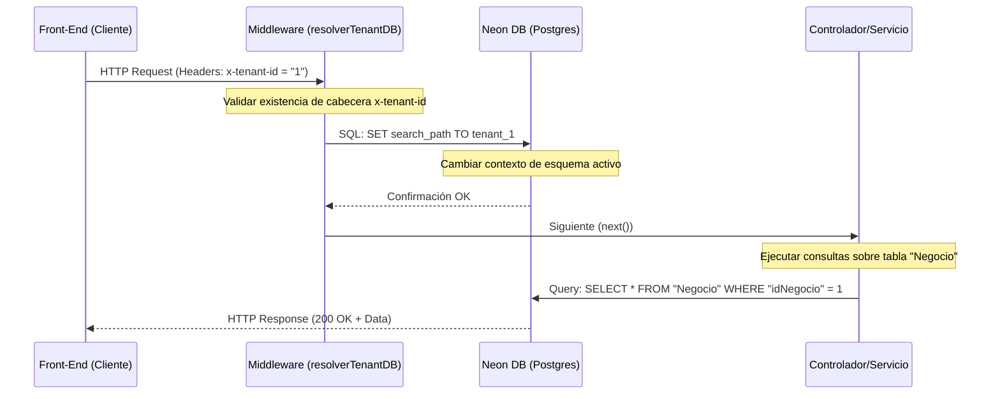

# Especificación Técnica de API: Módulo 1 (SaaS y Configuración del Negocio)

**Estándar de Documentación de Cátedra (UTN FRC)**  
**Proyecto:** SaaS Lavandería Multi-Negocio  
**Módulo:** SaaS y Configuración del Negocio (Multi-Tenant)  

---

## 1. Arquitectura y Patrones de Diseño Recomendados

### Estilo Arquitectónico: Arquitectura en Capas (Layered Architecture)
Para asegurar el bajo acoplamiento y la alta cohesión del sistema, se estructura el software utilizando el patrón **Layered (En Capas)**, aislando las distintas problemáticas en capas independientes de servicios autocontenidos:
*   **Capa de Presentación («boundary»)**: El Front-End ya construido, que maneja la interacción humano-máquina y valida las reglas visuales.
*   **Capa de Control/Servicios («control»)**: Los controladores y gestores del backend que coordinan el flujo de las transacciones. Es aquí donde el Middleware Multi-Tenant intercepta la cabecera `x-tenant-id` para ejecutar la sentencia dinámica en PostgreSQL Neon (`SET search_path TO tenant_{id}`) antes de cada consulta física.
*   **Capa de Dominio/Entidades («entity»)**: Las clases de negocio puras (`Negocio`, `Empleado`, `Usuario`, etc.) que resuelven los algoritmos operativos y persisten en la base de datos.
*   **Capa de Integración/Frontera Externa**: Clases adaptadoras para conectar con servicios de terceros (ARCA/AFIP y Mercado Pago) sin contaminar la lógica interna.

### Patrones de Diseño (GoF) Claves Aplicados al Módulo 1
*   **Patrón Adapter (Adaptador)**: Se aplica para encapsular las llamadas de red a las APIs externas de Mercado Pago y AFIP/ARCA. Mediante interfaces estandarizadas (ej: `IAdaptadorFacturacion` e `IAdaptadorMercadoPago`), el gestor del sistema realiza las peticiones de homologación y validación de manera polimórfica. Esto facilita el cambio de pasarela o proveedor sin modificar la lógica interna del negocio.

---

## 2. Enunciación de Casos de Uso y Actores del Módulo 1

*Nomenclatura formal de la UTN FRC: Verbo en Infinitivo + Objeto.*

### Jerarquía de Actores
*   **Usuario** (Actor Abstracto).
    *   **Empleado** (Actor Físico, especialización de Usuario).
        *   **Administrador** (Especialización de Empleado).
    *   **Inquilino / Dueño de Lavandería** (Especialización de Usuario).
*   **AFIP / ARCA** (Actor Secundario / Sistema Externo).
*   **Mercado Pago** (Actor Secundario / Sistema Externo).

### Casos de Uso del Módulo 1
*   **CU-01: Registrar Cuenta de Negocio** (AP: Inquilino / Dueño de Lavandería)
*   **CU-02: Configurar Identidad Visual y Datos Fiscales** (AP: Administrador de Lavandería)
*   **CU-03: Configurar Conexión AFIP** (AP: Administrador de Lavandería, AS: AFIP)
*   **CU-04: Configurar Integración de Mercado Pago** (AP: Administrador de Lavandería, AS: Mercado Pago)

---

## 3. Arquitectura de Aislamiento de Datos en Neon (Multi-Tenant por Esquemas)

Para garantizar un aislamiento fuerte de la información entre diferentes lavanderías utilizando una base de datos PostgreSQL en la nube (Neon), se utiliza un esquema de **Aislamiento por Base de Datos Compartida con Esquemas Separados**.

### Funcionamiento del Middleware de Enrutamiento
Cada petición HTTP/HTTPS enviada desde el cliente (Front-End) debe incluir la cabecera `x-tenant-id`, cuyo valor identifica al negocio (ej: `tenant_1` o simplemente el ID del negocio `1`).

El flujo de procesamiento en el Back-End se define a continuación:



1.  **Extracción del ID**: El middleware lee el header `x-tenant-id`. Si no se provee, interrumpe el flujo y responde `400 Bad Request`.
2.  **Configuración del search_path**: Antes de delegar el control al controlador, el middleware ejecuta sobre la conexión activa de la base de datos la sentencia SQL:
    ```sql
    SET search_path TO tenant_{x-tenant-id};
    ```
    Esto le indica a PostgreSQL que cualquier consulta subsiguiente que no especifique esquema (ej: `SELECT * FROM "Negocios"`) se resolverá dentro del esquema del cliente respectivo.
3.  **Aislamiento Operativo**: El controlador ejecuta las consultas de Sequelize sobre el modelo `Negocio` de forma transparente y completamente segura, evitando fugas de información.

---

## 4. Pantallas y Contratos de la API

### PANTALLA 1: Configuración de Datos Generales y Branding Visual
Permite actualizar la razón social, CUIT y colores corporativos para estilizar dinámicamente el portal.

*   **Comportamiento del Front-End:**
    *   Formulario reactivo que carga los valores actuales de configuración del negocio.
    *   Selector de color visual (Color Picker) que formatea y restringe las entradas a strings hexadecimales (`#RRGGBB`).
*   **Validación de CUIT (Algoritmo de Dígito Verificador):**
    *   El backend valida que el string tenga exactamente 11 caracteres numéricos.
    *   Se aplica el algoritmo del dígito verificador nacional (AFIP):
        1. Se multiplican los primeros 10 dígitos por los coeficientes `[5, 4, 3, 2, 7, 6, 5, 4, 3, 2]` respectivamente y se calcula la sumatoria.
        2. Se obtiene el resto de la división de la sumatoria por 11.
        3. El dígito verificador esperado es `11 - resto`. Si el resultado es 11, se asume `0`. Si es 10, se evalúa caso especial (no válido directamente para CUIT estándar sin recalcular prefijo).
        4. Debe coincidir con el dígito número 11.

*   **Contrato de API:**
    *   **Endpoint:** `POST /api/v1/negocio/branding`
    *   **Request (JSON):**
        ```json
        {
          "razonSocial": "Lavandería La Burbuja S.R.L.",
          "cuit": "30715489623",
          "colorPrincipal": "#4F46E5",
          "colorSecundario": "#10B981"
        }
        ```
    *   **Response Exitoso (HTTP 200 OK):**
        ```json
        {
          "success": true,
          "message": "Identidad visual y datos fiscales actualizados correctamente.",
          "data": {
            "idNegocio": 1,
            "razonSocial": "Lavandería La Burbuja S.R.L.",
            "cuit": "30715489623",
            "colorPrincipal": "#4F46E5",
            "colorSecundario": "#10B981"
          }
        }
        ```
    *   **Response Error - CUIT Inválido (HTTP 400 Bad Request):**
        ```json
        {
          "success": false,
          "error": "VALIDATION_ERROR",
          "message": "El CUIT ingresado no es válido matemáticamente según el algoritmo verificador de AFIP."
        }
        ```

---

### PANTALLA 2: Configuración de Facturación Electrónica (AFIP/ARCA)
Permite activar la facturación legal y cargar los certificados criptográficos provistos por AFIP en la homologación.

*   **Comportamiento del Front-End:**
    *   Un switch/toggle activa la propiedad `facturacionHabilitada`.
    *   Si el switch está apagado (`false`), los inputs de carga de archivos (.crt y .key) quedan bloqueados e invisibilizados.
    *   Si está encendido (`true`), se habilitan los selectores de archivos locales de tipo arrastrar y soltar (drag and drop).
*   **Validación Técnica en el Back-End:**
    *   La petición se recibe con codificación `multipart/form-data`.
    *   Se comprueba la extensión y la integridad sintáctica de los archivos (PEM formato para certificados X.509 y llaves PKCS#8).
    *   Los archivos se almacenan en el sistema de almacenamiento persistente del servidor y sus rutas de acceso se guardan en `certificadoAfipPath` y `llaveAfipPath`.

*   **Contrato de API:**
    *   **Endpoint:** `PUT /api/v1/negocio/facturacion-config`
    *   **Request (multipart/form-data):**
        *   `facturacionHabilitada`: `true`
        *   `certificado`: `[Archivo Binario .crt]`
        *   `llavePrivada`: `[Archivo Binario .key]`
    *   **Response Exitoso (HTTP 200 OK):**
        ```json
        {
          "success": true,
          "message": "Configuración de facturación electrónica AFIP actualizada exitosamente.",
          "data": {
            "idNegocio": 1,
            "facturacionHabilitada": true,
            "certificadoAfipPath": "/storage/certs/tenant_1/afip.crt",
            "llaveAfipPath": "/storage/certs/tenant_1/afip.key"
          }
        }
        ```
    *   **Response Error - Certificado Inválido/Corrupto (HTTP 422 Unprocesssable Entity):**
        ```json
        {
          "success": false,
          "error": "INVALID_CERTIFICATE_FORMAT",
          "message": "El archivo de certificado (.crt) o la llave privada (.key) no tienen un formato PEM X.509 válido o están corruptos."
        }
        ```

---

### PANTALLA 3: Integración de Pagos Online (Mercado Pago)
Permite la automatización de cobros digitales y links de pago mediante Mercado Pago.

*   **Comportamiento del Front-End:**
    *   Un input de tipo contraseña (enmascarado para seguridad) permite ingresar el `tokenMercadoPago` (Access Token).
    *   Al ingresar un token, se habilita el botón "Validar Conexión" que llama síncronamente al backend sin guardar aún el registro en la base de datos.
*   **Validación Técnica en el Back-End:**
    *   Al recibir la petición, el backend realiza un request de validación síncrono al endpoint oficial de Mercado Pago:
        `GET https://api.mercadopago.com/v1/payment_methods`
    *   Se inyecta la cabecera: `Authorization: Bearer {tokenMercadoPago}`.
    *   Si Mercado Pago responde `200 OK`, el backend actualiza la propiedad `tokenMercadoPago` en la base de datos del negocio. Si responde `401 Unauthorized`, se rechaza de inmediato.

*   **Contrato de API:**
    *   **Endpoint:** `POST /api/v1/negocio/mercadopago/validate`
    *   **Request (JSON):**
        ```json
        {
          "tokenMercadoPago": "APP_USR-6154897253-TEST-XXXXXX"
        }
        ```
    *   **Response Exitoso (HTTP 200 OK):**
        ```json
        {
          "success": true,
          "message": "Credenciales de Mercado Pago homologadas exitosamente y persistidas.",
          "data": {
            "estadoConexion": "Activo"
          }
        }
        ```
    *   **Response Error - Credencial Inválida (HTTP 401 Unauthorized):**
        ```json
        {
          "success": false,
          "error": "INVALID_GATEWAY_CREDENTIALS",
          "message": "El token de Mercado Pago proporcionado es inválido o ha expirado. Verifique sus credenciales en el panel de Mercado Pago Developers."
        }
        ```
