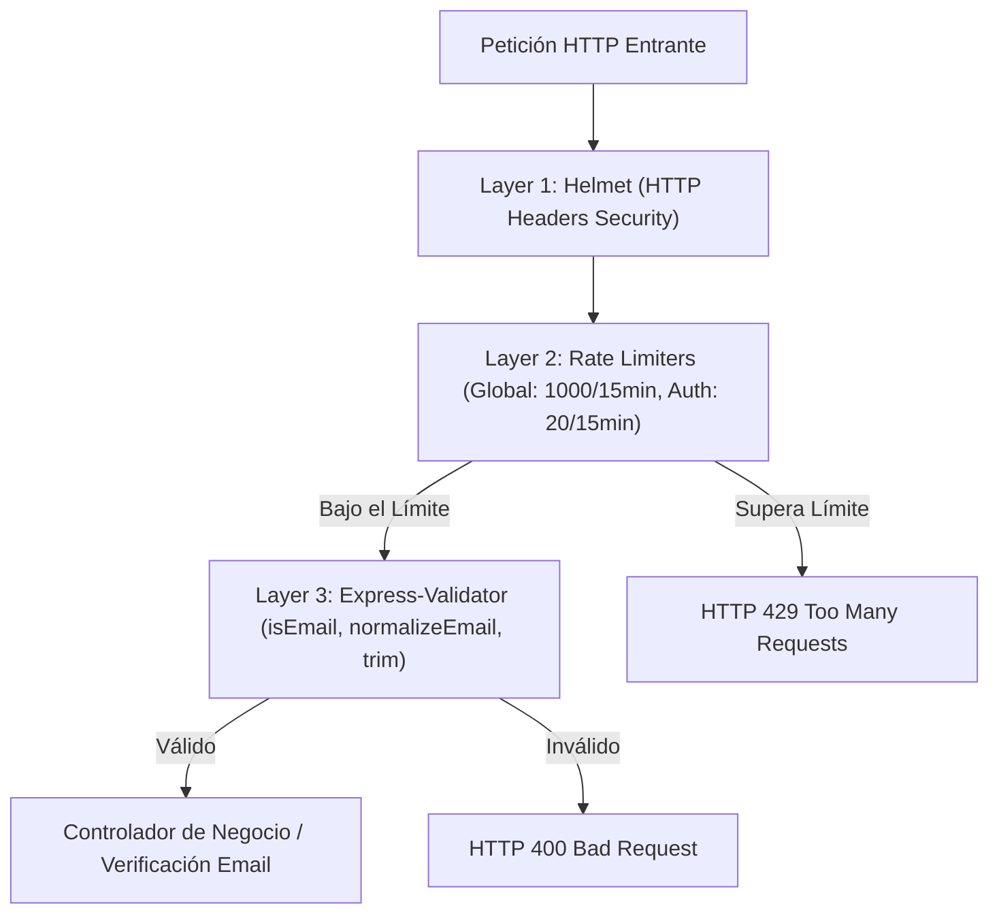

# Especificación Técnica de API y Requerimientos: Validación de Email, Rate Limiting y Resiliencia DoS

**Estándar de Documentación de Cátedra (UTN FRC)**  
**Proyecto:** SaaS Lavandería Multi-Negocio  
**Módulo:** Módulo de Seguridad, Validación de Email y Rate Limiting (`security` / `rate-limit`)  

---

## 1. Arquitectura de Seguridad y Defensa en Profundidad

La plataforma implementa controles de resiliencia frente a ataques de denegación de servicio (DDoS), fuerza bruta y suplantación de identidad mediante 3 capas de protección:

---

## 2. Validación y Verificación Transaccional de Email

### Sanitización de Entrada (`express-validator`)
*   `isEmail()`: Estructura RFC 5322 (`usuario@dominio.com`).
*   `toLowerCase()`: Normalización a minúsculas absolutas.
*   `trim()`: Remoción de espacios colindantes.

### Verificación en 2 Pasos (Código de 6 Dígitos)
1.  **Registro:** Al crearse un usuario, el servidor genera un código aleatorio de 6 dígitos con expiración de 15 minutos y dispara el envío SMTP.
2.  **Verificación (`POST /api/auth/verify-email`):** Valida el código contra la DB y activa la cuenta (`emailConfirmado = true`).

---

## 3. Limitadores de Tasa (Rate Limiters)

| Limitador | Ventana (`windowMs`) | Límite Máximo (`max`) | Rutas Aplicadas | Código de Respuesta |
| :--- | :---: | :---: | :--- | :---: |
| **`authLimiter`** (Estricto) | 15 minutos | 20 peticiones / IP | `/api/auth/login`, `/api/auth/register`, `/api/auth/verify-email`, `/api/auth/forgot-password` | `HTTP 429` |
| **`globalLimiter`** (Global) | 15 minutos | 1000 peticiones / IP | Todas las rutas `/api/*` | `HTTP 429` |

---

## 4. Diagnóstico de Códigos HTTP de Seguridad

| Código HTTP | Significado Contable / Operativo | Ejemplo de Causa |
| :---: | :--- | :--- |
| **200 OK** | Verificación de email exitosa | Código de 6 dígitos correcto. |
| **400 Bad Request** | Formato de email o código inválido | Email con sintaxis incorrecta o código expirado. |
| **429 Too Many Requests** | Límite de tasa excedido (Rate Limit) | Exceder 20 intentos de auth o 1000 peticiones globales en 15 minutos. |
