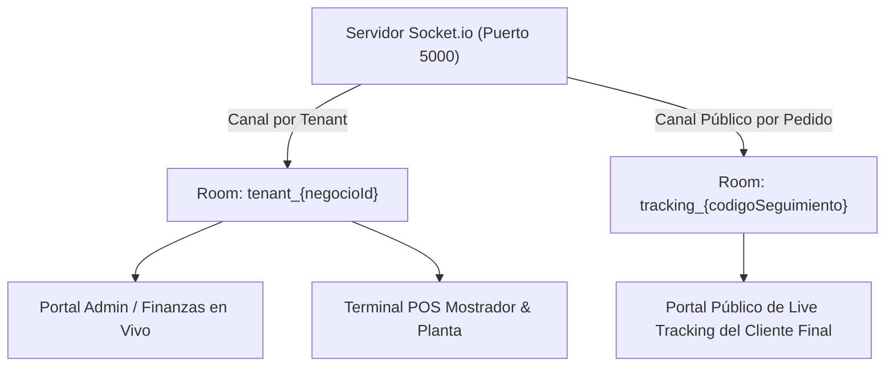

# Especificación Técnica de API y Requerimientos: Arquitectura WebSockets (Socket.io) y Comunicación en Tiempo Real

**Estándar de Documentación de Cátedra (UTN FRC)**  
**Proyecto:** SaaS Lavandería Multi-Negocio  
**Módulo:** Arquitectura Transversal - Comunicación Bidireccional en Tiempo Real (Socket.io WebSockets)  

---

## 1. Arquitectura y Modelo de Canales (Rooms) Multi-Tenant

La comunicación en tiempo real en la plataforma lavandería se gestiona mediante un servidor **Socket.io** sobre el puerto `5000`, organizado por **Canales / Cuartos (Rooms)** aislados por negocio y por código de seguimiento público:



---

## 2. Matriz de Casos de Uso, Actores y Eventos WebSockets

| Ámbito del Sistema | Caso de Uso (CU) | Evento Socket.io | Emisor (Backend/Frontend) | Suscriptores / Receptores | Propósito Operativo |
| :--- | :--- | :--- | :--- | :--- | :--- |
| **Terminal POS & Planta** | **CU-12: Tablero Kanban de Lavado** | `pedido:creado`<br>`pedido:estado_cambiado` | Servidor Backend (al crear/modificar pedido) | Empleados de Planta / Operarios | Actualización instantánea de tarjetas del Kanban sin refrescar la pantalla. |
| **Portal Admin & Finanzas** | **CU-24: Auditar Movimientos de Caja en Vivo** | `caja:apertura`<br>`caja:cierre`<br>`gasto:registrado` | Servidor Backend (al abrir/cerrar turno o egreso) | Administrador / Gerente | Notificación toast y actualización inmediata de KPIs de efectivo en caja. |
| **Live Tracking Público** | **CU-50: Live Tracking del Cliente Final** | `tracking:actualizado` | Servidor Backend (al cambiar estado a LISTO) | Cliente Final (en `/tracking/[negocioId]/[codigo]`) | Barra de progreso dinámica que avisa al cliente cuando su ropa está lista para retirar. |
| **Notificaciones Push** | **CU-51: Avisos por WhatsApp** | `whatsapp:enviado` | Servidor Backend (al emitir aviso por WhatsApp) | Empleado de Mostrador | Feedback visual confirmando que el cliente fue notificado. |

---

## 3. Especificación de Contratos de Eventos Socket.io

### 3.1. Evento `pedido:estado_cambiado`
- **Canal (Room):** `tenant_{negocioId}`
- **Payload:**
```json
{
  "pedidoId": 45,
  "codigoSeguimiento": "LAV-9823",
  "nuevoEstado": "LISTO_PARA_RETIRAR",
  "timestamp": "2026-08-13T18:54:00Z"
}
```

### 3.2. Evento `tracking:actualizado` (Live Tracking Cliente Final)
- **Canal (Room):** `tracking_{codigoSeguimiento}`
- **Payload:**
```json
{
  "codigoSeguimiento": "LAV-9823",
  "estado": "LISTO_PARA_RETIRAR",
  "porcentajeProgreso": 100,
  "mensaje": "¡Tu prenda está lista para ser retirada en la sucursal!"
}
```

### 3.3. Evento `gasto:registrado` (Auditoría Admin en Vivo)
- **Canal (Room):** `tenant_{negocioId}`
- **Payload:**
```json
{
  "gastoId": 14,
  "montoTotal": 3500.00,
  "categoria": "Insumos",
  "descripcion": "Compra de detergente",
  "cajaId": 3
}
```

---

## 4. Emisión de Eventos desde los Servicios de Backend (`back2`)

Los servicios de backend emiten eventos mediante el helper `getIO()` de `src/socket.js`:

```javascript
import { getIO } from "../../../socket.js";

// Ejemplo de emisión al cambiar estado de un pedido
getIO().to(`tenant_${negocioId}`).emit("pedido:estado_cambiado", {
    pedidoId: pedido.numeroPedido,
    codigoSeguimiento: pedido.codigoSeguimiento,
    nuevoEstado: nuevoEstado
});

getIO().to(`tracking_${pedido.codigoSeguimiento}`).emit("tracking:actualizado", {
    codigoSeguimiento: pedido.codigoSeguimiento,
    estado: nuevoEstado
});
```

---

## 5. Resumen de Ámbitos de Aplicación en Todo el Sistema

1. **Portal del Empleado (POS & Terminal de Planta):** Sincronización instantánea de recepción de prendas y cambios de estado en las lavadoras/secadoras.
2. **Portal del Administrador (Dashboard & Finanzas):** Notificación de egresos, movimientos de caja e indicadores de rendimiento en tiempo real.
3. **Portal del Cliente Final (Public Live Tracking):** Notificación en vivo sin necesidad de que el cliente refresque la página para saber si su ropa fue lavada.
